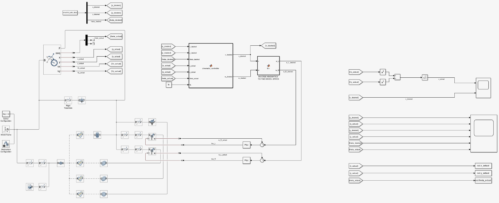

# Simulink-Based Design and Control of an Autonomous Library Assistant Robot

  -FFD700?style=for-the-badge)

 

**Digital Twin simulation of an autonomous differential drive robot for library navigation. Features PRM path planning in MATLAB and double-loop PI control in Simulink.**


---


## 📋 Prerequisites


To run this simulation, ensure you have the following environment:


* **Knowledge:**

    * Fundamentals of Robotics (Differential Drive Kinematics)

    * Control Theory (PI Controllers)

    * MATLAB/Simulink environment usage

* **Hardware:**

    * PC with Windows, Linux, or macOS capable of running MATLAB/Simulink.

* **Software:**

    * MATLAB (Recommended: R2023b or newer)

    * Simulink

    * **Required Toolboxes:**

        * Robotics System Toolbox

        * Navigation Toolbox

        * Control System Toolbox


---


## 📖 Introduction


Large libraries face operational challenges in guiding users and managing book logistics. Autonomous robots offer a solution to improve efficiency. This project addresses the need for a robust navigation system, proposing a design validated entirely through simulation.


We present a complete framework, from path planning in a virtual map to high-precision motor control, demonstrating a viable proof-of-concept ("Digital Twin") for a library assistant robot.


**Project Objectives:**

* Develop a virtual library environment using Matlab's `binaryOccupancyMap`.

* Implement a Probabilistic Roadmap (PRM) algorithm for global, collision-free path planning.

* Generate smooth, time-based trajectories using cubic polynomial interpolation.

* Design a double-loop (cascade) control system in Simulink for precise trajectory tracking.

* Validate the system's performance by comparing desired vs. actual simulated paths.


---


## 🔧 Simulation Environment


**Description of the environment used:**


* **Main Simulator:** MATLAB & Simulink

* **Map Generation:** `binaryOccupancyMap` (inflated by robot radius) [NAVIGATION TOOLBOX]

* **Path Planning Algorithm:** `mobileRobotPRM` (Probabilistic Roadmap) [NAVIGATION TOOLBOX]

* **Control Architecture:** Simulink Block Diagram (Cascade Control)

---


## 🛠️ Configuration & Usage

Instructions to run the simulation:

1.  **Open the Main Script:**
    Open `main_run_simulation.m` in MATLAB.

2.  **Run the Script:**
    Click the **Run** button (or press F5).

    *Note:* You do **not** need to open the Simulink model manually. This master script automatically:
    * Calls `defineSimscapeParameters.m` and `planLibraryPath.m` to initialize parameters and map.
    * Executes `generateTrajectoryAndRunSim.m`.
    * Opens and runs the Simulink model `diff_drive.slx`.

3.  **Visualize:**
    Once the script finishes, the simulation results and trajectory plots will be displayed automatically.


---


## 💻 Code Example / Programming

The core of the navigation logic relies on the **Probabilistic Roadmap (PRM)** algorithm.

The following snippet demonstrates how the map is prepared and the planner is configured. First, the map is **inflated** by the robot's radius to create a safety margin (ensuring the physical robot doesn't scrape against obstacles). Then, the PRM is initialized with a high density of nodes to find a valid path through the library aisles.

```matlab
% --- 2. ROBOT PREPARATION & MAP INFLATION ---
robotRadius = 1.0; % Robot radius for path planning (m)
mapInflated = copy(libraryMap);
inflate(mapInflated, robotRadius);

% --- 3. PATH PLANNER (PRM) CONFIGURATION ---
prm = mobileRobotPRM;
prm.Map = mapInflated;
prm.NumNodes = 2500;         % Number of random points scattered on the map
prm.ConnectionDistance = 10; % Max distance to connect two nodes

```


The simulation environment is built upon a **Binary Occupancy Grid**, programmatically defined in MATLAB to ensure flexibility. Instead of using static maps, the layout is generated using parametric variables, allowing for rapid reconfiguration of the testing scenarios without manual redrawing.
The following snippet demonstrates the initialization of the library map and the definition of obstacle properties:

```matlab
% --- 1. CREATE LIBRARY MAP ---
% Large Map (80 rows x 120 columns)
mapMatrix = zeros(80, 120);

% Outer walls setup
mapMatrix(1, :) = 1;    mapMatrix(end, :) = 1;
mapMatrix(:, 1) = 1;    mapMatrix(:, end) = 1;

% Shelf properties (Parametric Design)
stackWidth = 1;         % Shelf width (m)
stackLength = 60;       % Shelf length (m)
stackTopY = 10;         % Y-position where shelves start
aisleWidth = 10;        % Space for aisles

% 4 Shelves on the LEFT of the entrance
stackColumn = aisleWidth + 1; % Start column (X=11)
```
### 🛠️ Customization & Layout Modification

Since the map is defined mathematically, extending or modifying the library layout is straightforward:

* **Adjusting Spacing:** Modifying the `aisleWidth` variable automatically recalculates the spacing between all subsequent shelves, allowing for easy testing of narrow-aisle navigation algorithms.
* **Adding Shelves:** To introduce additional storage units or change the configuration, you can simply target new indices in the `mapMatrix` (e.g., `mapMatrix(rows, cols) = 1`) using the existing logic loops.
* **Scaling the Environment:** The global dimensions can be altered by changing the `zeros(80, 120)` initialization, providing a scalable testing ground for the robot's path planning capabilities.


---
## ⚙️ Simulink Control Architecture

The following block diagram represents the complete **Digital Twin** of the robot, integrating high-level kinematic control with low-level motor dynamics and physical simulation.



### 🔍 System Breakdown

* **↖️ Top-Left: Reference Generation**
    The system inputs are derived from the **Path Planning** module. The `simulink_path_data` block provides the desired trajectory points ($x_{ref}, y_{ref}, \theta_{ref}$) which serve as the setpoints for the control loop.

* **⬆️ Top-Center: High-Level Kinematic Control**
    This is the "brain" of the robot.
    * **Cinematic Controller:** Calculates the position error and computes the required linear ($v$) and angular ($\omega$) velocities for the robot body.
    * **Inverse Kinematics:** Translates the robot's body velocities into individual wheel angular velocities ($\omega_L, \omega_R$).

* **⬇️ Bottom-Center: Low-Level Motor Control**
    This section implements the inner control loop.
    * **PI Controllers:** Two discrete `PI(s)` controllers regulate the torque ($\tau$) sent to the motors by comparing the desired wheel speeds with the actual feedback from the Simscape model.

* **↙️ Left & Bottom-Left: Simscape Multibody Plant**
    This vertical section represents the physical modeling of the robot (**Digital Twin**).
    * It includes the `World Frame`, `Solver Configuration`, and rigid body transforms that simulate the robot's chassis and wheels.
    * **Sensors** in this block measure the **actual state** ($x_{act}, y_{act}, \theta_{act}$), closing the primary feedback loop.

* **➡️ Right: Performance Monitoring**
    The output section contains **Scopes** and workspace writers to visualize real-time performance.
    * Graphs compare the *Desired vs. Actual* velocities.
    * Plots display the cross-track error and trajectory tracking accuracy during the simulation.

## ✅ Conclusion


All project objectives were successfully met. We have designed and validated a complete autonomous navigation system for a library robot.


**Key Findings:**

* The combination of **PRM planning** and a **double-loop PI/PI controller** provides a robust and highly accurate solution.

* Simulation results show minimal tracking error for X, Y, and Theta variables.

* This simulation serves as a validated "digital twin," significantly reducing the risk and cost of physical prototyping.


---


## 🔜 Future Improvements


* **Physical Prototype:** Construct a real-world robot based on the parameters validated in this simulation.

* **Dynamic Obstacles:** Implement local path planning (e.g., VFH algorithm) to avoid moving people or objects in real-time.

* **Sensor Integration:** Simulate LiDAR or Camera inputs for SLAM (Simultaneous Localization and Mapping) to replace the ideal map knowledge.


---


## ⚠️ Disclaimer


As indicated in the MIT License, this software is provided **"as is", without warranty of any kind**. The authors are not responsible for any damage to hardware, loss of data, or other issues resulting from the use of this code.


---


## 📚 Additional Resources


* [MathWorks: Mobile Robot Algorithms (Robotics System Toolbox)](https://www.mathworks.com/help/robotics/mobile-robot-algorithms.html)

* [Probabilistic Roadmaps (Kavraki et al., 1996)](https://doi.org/10.1109/70.508439)

* [Springer Handbook of Robotics](https://link.springer.com/book/10.1007/978-3-319-32552-1)


---


## 👥 Authors

**PM**
* **Marco Ferreri**
* **Pietro Borracelli**

**Project Team**
* Hugo Valdés Ortega
* José Francisco Reyes Maldonado
* Emilio Rafael García García
* Paul Pfister
* Irving Alejandro Vásquez Salinas
* Alejandro Alvarez Gil
* Paul Leonardo Morales Grunauer 

---


## 📬 Contact


This project is actively **maintained by Marco Ferreri and Pietro Borracelli**.

If you require assistance with the simulation, have technical questions regarding the control architecture, or wish to propose improvements, please do not hesitate to reach out directly to the maintainer.

* **Email:** marcoferreri.p@gmail.com
* **Email:** pietro.borracelli@gmail.com

For bug reports or specific feature requests, you are also encouraged to open a new **Issue** in this repository.
